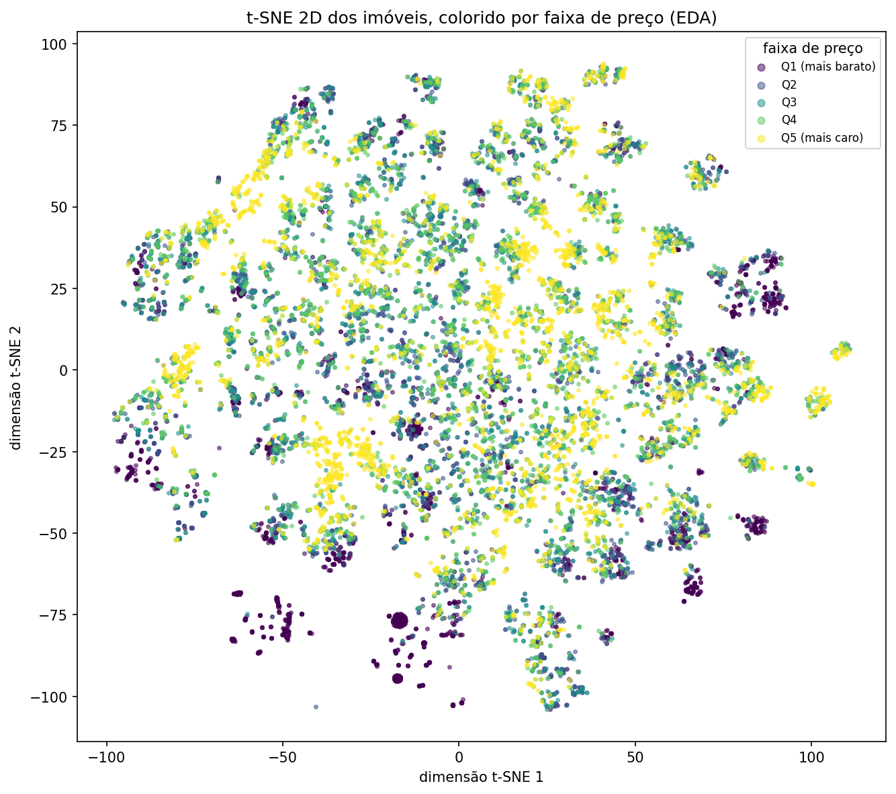

# Comparação Final dos Modelos — Fase 2 (issue #25)

**Projeto:** Previsão de Preços de Imóveis em João Pessoa (PB)
**Disciplina:** Paradigmas de Aprendizagem de Máquina — UFPB
**Depende de:** #20, #21, #22, #23, #24 · **Protocolo:** [`docs/protocolo_comparacao.md`](protocolo_comparacao.md)
**Artefatos desta issue:** `data/processed/resultados_modelos.csv`, `cv_mae_por_fold.csv`,
`decisao_criterio.json`, `resultados_pca.csv`, `tsne_coords.csv`, `docs/figuras/tsne_precos.png` —
todos gerados por uma única rodada (`train.py` → `decisao.py` → `pca_variant.py` → `tsne_exploracao.py`),
nesta ordem, para não misturar execuções parciais de branches diferentes.

---

## 1. Escopo e critério de decisão

Seis candidatos competem: `arvore_decisao`, `knn`, `mlp`, `ols`, `ridge`,
`gradient_boosting_ajustado`. `baseline_mediana` e `gradient_boosting` (configuração
padrão) aparecem nas tabelas como referência, mas não competem — não são
"candidatos" no sentido do protocolo (`docs/protocolo_comparacao.md` §3.1).

O critério, declarado **antes** de qualquer resultado (issue #25) e implementado em
[`src/imoveis_jp/models/decisao.py`](../src/imoveis_jp/models/decisao.py):

1. Vence quem tiver o menor MAE médio de `GroupKFold(5)` no treino, sobre `log(preço)`.
2. A vantagem sobre o segundo colocado só é **declarada** se: a diferença pareada
   favorece o mesmo modelo nas **cinco** folds, **e** a diferença média é **≥ 0,005**.
3. Se qualquer condição falhar: **empate técnico**, desempatado nesta ordem —
   explicabilidade, custo de previsão, número de hiperparâmetros.
4. O teste é avaliado **depois**, uma vez, e não participa da decisão.

**Por que 0,005:** o desvio entre folds das melhores configurações do projeto fica
entre 0,0032 e 0,0043 (ver `docs/protocolo_comparacao.md`). Diferença menor que um
desvio não se sustenta — já aconteceu, nesta mesma base, de a busca de
hiperparâmetros eleger uma configuração por 0,0005 de vantagem quando o eixo
inteiro não tinha efeito nenhum sobre o resultado.

---

## 2. Comparação pareada por fold

MAE(log) em cada uma das cinco folds de `GroupKFold`, mesmo split para todos —
a base para a regra 2 do critério (`data/processed/cv_mae_por_fold.csv`):

| modelo | fold 0 | fold 1 | fold 2 | fold 3 | fold 4 | média | desvio |
|---|---|---|---|---|---|---|---|
| **gradient_boosting_ajustado** | 0,1992 | 0,2021 | 0,2019 | 0,1966 | 0,1944 | **0,1988** | 0,0030 |
| ridge | 0,2575 | 0,2581 | 0,2536 | 0,2535 | 0,2530 | 0,2551 | 0,0022 |
| ols | 0,2574 | 0,2581 | 0,2536 | 0,2535 | 0,2531 | 0,2551 | 0,0022 |
| arvore_decisao | 0,2887 | 0,2834 | 0,2885 | 0,2844 | 0,2778 | 0,2846 | 0,0040 |
| mlp | 0,3105 | 0,3268 | 0,3237 | 0,3153 | 0,3048 | 0,3162 | 0,0081 |
| knn | 0,3256 | 0,3289 | 0,3192 | 0,3160 | 0,3113 | 0,3202 | 0,0064 |

Sem a captura fold a fold isso não seria verificável — só a média, como o projeto
reportava até esta issue, não diz se a vantagem é consistente ou se veio de uma
fold sortuda.

---

## 3. Aplicação do critério

Ranking por CV: **gradient_boosting_ajustado → ridge → ols → arvore_decisao → mlp → knn.**

Comparação pareada entre o 1º e o 2º colocado (`gradient_boosting_ajustado` vs
`ridge`), fold a fold:

| fold | ridge − gb_ajustado |
|---|---|
| 0 | +0,0582 |
| 1 | +0,0560 |
| 2 | +0,0517 |
| 3 | +0,0569 |
| 4 | +0,0586 |

Todas as cinco folds favorecem `gradient_boosting_ajustado`, com diferença média de
**0,0563** — mais de 11× o limiar de 0,005.

> **RESULTADO: VANTAGEM DECLARADA.** Vencedor: **`gradient_boosting_ajustado`.**

Isso foi decidido e registrado em `data/processed/decisao_criterio.json` **antes**
de qualquer número da seção 4 ser lido — o script `decisao.py` não abre nenhuma
coluna `*_teste`, por construção.

---

## 4. Avaliação única no teste

Rodada uma única vez, junto da CV, na mesma chamada de `train.py::executar()`.
Ordenada pelo MAE de **CV** (não pelo de teste, para a ordem não parecer escolhida
pelo teste):

| modelo | CV MAE(log) | Teste MAE (R$) | Teste erro % mediano | Teste R² (log) |
|---|---|---|---|---|
| **gradient_boosting_ajustado** | 0,1988 | R$ 170.150 | 15,6% | 0,897 |
| gradient_boosting (padrão) | 0,2076 | R$ 172.892 | 16,1% | 0,892 |
| ridge | 0,2551 | R$ 249.200 | 19,1% | 0,844 |
| ols | 0,2551 | R$ 249.118 | 19,1% | 0,844 |
| arvore_decisao | 0,2846 | R$ 244.051 | 20,0% | 0,780 |
| mlp | 0,3162 | R$ 286.047 | 20,8% | 0,746 |
| knn | 0,3202 | R$ 269.182 | 23,8% | 0,715 |
| baseline_mediana | 0,6183 | R$ 443.793 | 43,1% | −0,002 |

O ranking de teste bate com o de CV em toda a extensão, exceto a árvore isolada,
que no teste supera Ridge/OLS em MAE absoluto (R$ 244 mil vs R$ 249 mil) apesar de
perder na CV — sinal de alta variância (a árvore memoriza o treino, ver
`docs/modelos/arvore.md`), não de que a CV escolheu errado: o critério nunca
comparou árvore contra Ridge por essa métrica.

---

## 5. Variante PCA

Hipótese registrada antes de rodar (`src/imoveis_jp/models/pca_variant.py`): PCA
**piora**. É uma projeção linear, e o que falta para o modelo linear é justamente a
interação **não-linear** entre área e bairro — rotacionar o espaço não cria essa
interação, só reduz dimensão. Para os modelos de árvore, um componente principal
(combinação linear de dezenas de dummies de bairro) não tem um limiar
interpretável nem alinhado aos cortes que a árvore faria sem PCA. E destrói a
interpretabilidade que dá o resultado mais forte do projeto — `bairro` isolado é o
atributo mais importante por permutação (`docs/modelagem.md`).

PCA com 95% da variância retida, mesmo split e mesmas folds:

| modelo | sem PCA | com PCA | diferença | componentes (95% var.) |
|---|---|---|---|---|
| gradient_boosting_ajustado | 0,1988 | 0,2413 | **+0,0425** | 50 |
| ridge | 0,2551 | 0,3240 | **+0,0688** | 50 |
| ols | 0,2551 | 0,3240 | **+0,0688** | 50 |
| knn | 0,3202 | 0,3341 | **+0,0139** | 69 |
| arvore_decisao | 0,2846 | 0,3726 | **+0,0880** | 50 |
| mlp | 0,3162 | 0,4077 | **+0,0915** | 69 |

**Hipótese confirmada nos seis candidatos, sem exceção.** Curiosamente, quem menos
piora em termos absolutos é `gradient_boosting_ajustado` (+0,0425) — mas mesmo
assim PCA o joga para pior que o Ridge/OLS *sem* PCA (0,2413 vs 0,2551), uma
inversão completa do ranking: 50 componentes lineares emburrecem o melhor modelo
do projeto a ponto de ele perder para os piores modelos *sem* PCA. Quem mais sofre
é KNN em termos relativos mais moderados (+0,0139, o menor delta absoluto) — a
única leitura possível é que a distância euclidiana do KNN já estava tão diluída
pela alta dimensionalidade original (132 colunas) que reduzir para 69 componentes
quase não muda a geometria que importa para ele, ao contrário dos modelos que
dependiam de cortes/coeficientes sobre colunas originais interpretáveis.

---

## 6. t-SNE (EDA — não entra em nenhum modelo)

Projeção 2D sobre as 15.301 linhas da base inteira (não só o treino — é leitura
exploratória, a regra de não tocar no teste não se aplica aqui), coordenadas em
`data/processed/tsne_coords.csv`.

O gráfico mostra dezenas de aglomerados pequenos e bem definidos — esperado: com
132 colunas majoritariamente binárias e esparsas (a maior parte dummies de
bairro), o t-SNE tende a agrupar por **coincidência exata de padrão categórico**
antes de qualquer coisa contínua. Dentro da maioria dos aglomerados as cinco
faixas de preço aparecem **misturadas**, sem gradiente limpo — o que já era
esperado, e é consistente com o próprio argumento da seção 5: dois imóveis do
mesmo bairro (mesmo padrão categórico, mesmo aglomerado) ainda têm preços bem
diferentes se a área mudar, porque o preço depende da **combinação** área×bairro,
não de bairro isolado. Os poucos aglomerados isolados quase puramente roxos (Q1,
mais barato) — nos cantos inferior e inferior-esquerdo da figura — correspondem a
bairros de padrão uniformemente baixo, onde a variação de área pesa menos.
Isso é leitura visual, não conclusão estatística, e não influenciou nenhum modelo
desta comparação.

---

## 7. Docs individuais consolidadas

| modelo | CV MAE(log) | doc | observação |
|---|---|---|---|
| **gradient_boosting_ajustado** | 0,1988 | [`gradient_boosting.md`](modelos/gradient_boosting.md) | Vencedor. Interação capturada implicitamente por cortes em sequência; ganho do ajuste de hiperparâmetros sobre o padrão é pequeno (4,2%) frente à distância para o linear — a família do modelo importa mais que o tuning. |
| ridge | 0,2551 | [`ridge.md`](modelos/ridge.md) | Busca de `alpha` devolveu o próprio default — o gargalo é forma funcional aditiva, não falta de regularização. |
| ols | 0,2551 | [`ols.md`](modelos/ols.md) | Estatisticamente indistinguível de Ridge (diferença na 5ª casa) — a colinearidade do one-hot não estava inflando coeficientes o bastante para a regularização importar. |
| arvore_decisao | 0,2846 | [`arvore.md`](modelos/arvore.md) | `max_depth=None` memoriza o treino quase por completo (MAE treino R$2.153); podada por `ccp_alpha`/`min_samples_leaf`, é o modelo mais explicável do grupo, com o custo de ficar atrás dos outros cinco na CV. |
| mlp | 0,3162 | [`mlp.md`](modelos/mlp.md) | Supera a baseline nula com folga, mas sofre em matriz esparsa tabular — otimização por gradiente em 63 binárias ruidosas converge pior que cortes ortogonais de árvore/boosting. |
| knn | 0,3202 | [`knn.md`](modelos/knn.md) | Pior dos seis. A própria hipótese previu esse desfecho como diagnóstico: maldição da dimensionalidade — distância euclidiana em 132 colunas majoritariamente binárias deixa de discriminar "imóvel parecido" de "imóvel do mesmo bairro". |

`arvore.md` e `mlp.md` foram entregues pelos donos originais (issues #21 e #23);
`ridge.md`, `ols.md`, `gradient_boosting.md` e `knn.md` foram escritos durante esta
consolidação porque não haviam sido entregues junto dos candidatos (issues #22 e
#24 fecharam sem o markdown; Ridge/GB nunca tiveram issue própria). Cada um traz
uma nota no topo explicando isso — nenhum é atribuído a uma autoria que não
aconteceu.

---

## 8. Viés em aberto

`docs/protocolo_comparacao.md` §4 e a própria issue #25 avisam: **toda feature que
só o modelo não-linear consegue inferir sozinho enviesa a comparação a favor
dele.** `venda_direta` já foi resolvida (`docs/modelagem.md` §9.11) — hoje é uma
coluna explícita, disponível para todos os modelos igualmente.

O que **não** foi resolvido nesta issue, porque não estava no escopo dos
entregáveis: a interação `bairro × área_útil` ainda não é uma coluna explícita na
matriz. O boosting e a árvore reconstroem essa interação sozinhos, por
construção; Ridge, OLS, KNN e MLP não têm como. Parte da distância medida nas
seções 3 e 4 entre a família de árvores e o resto é, portanto, esse pedaço de
engenharia de atributos que falta — não só capacidade do algoritmo. Registrado
aqui como limitação conhecida para uma etapa futura, não como algo resolvido.

---

## 9. Conclusão

`gradient_boosting_ajustado` vence com vantagem declarada (regra 2 do critério:
cinco de cinco folds a favor, diferença média 0,0563 ≫ 0,005) e confirma no teste,
tocado uma única vez, depois da decisão: MAE de R$ 170.150, erro mediano de 15,6%,
R² de 0,897 em log — o menor erro e a maior explicação de variância entre os oito
modelos avaliados. PCA piora todos os seis candidatos sem exceção, confirmando a
hipótese de que a projeção linear não substitui a interação não-linear que o
problema precisa. O t-SNE não muda nenhuma conclusão — é leitura exploratória,
coerente com o que os modelos já mostravam. A vantagem do boosting continua
parcialmente explicada por engenharia de atributos implícita (interação
bairro×área ainda não explícita na matriz), registrada como trabalho futuro, não
como falha desta comparação.
