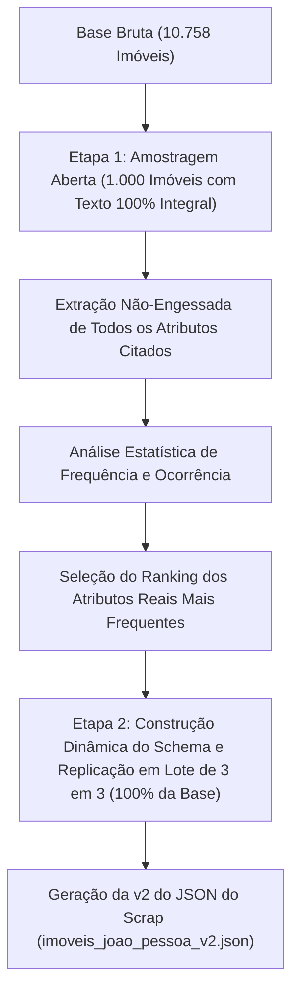

# Documentação Técnica e Acadêmica da Issue #9: Amostragem Empírica e Rotação Multi-Chave via LLM

**Autor:** Gabriel Ribeiro (`@gabrielbribeiroo`)  
**Projeto:** Previsão e Análise de Preços de Imóveis em João Pessoa (PB)  
**Disciplina:** Paradigmas de Aprendizagem de Máquina — UFPB  
**Módulo:** `src/imoveis_jp/processing\extract_llm_features.py`  
**Data:** 31/07/2026  

---

## 1. Fundamentação da Metodologia Empírica (Amostragem Aberta em 2 Etapas)

Para evitar decisões arbitrárias sobre quais atributos devem ser extraídos dos textos livres das descrições, adotou-se uma **metodologia estritamente orientada a dados (Data-Driven Discovery)**:



---

## 2. Processamento com Texto 100% Integral e Rotação Multi-Chave de API

Adotou-se o envio da **`descricao_completa` 100% integral (sem nenhum limite de truncamento de texto)** em lotes de 3 em 3 imóveis (`--batch-size 3`). A escolha dessa arquitetura fundamenta-se nas seguintes razões técnicas e empíricas:

### 📐 2.1 Cobertura Textual de 100% e Máxima Riqueza
Garante que **absolutamente nenhuma frase, parágrafo ou detalhe digitado pelos corretores seja descartado**, capturando 100% das informações de posição solar, praia, fase da obra, reformado, permuta, FGTS e diferenciais raros de luxo.

### 🔑 2.2 Rotação de Múltiplas Chaves de API (*Round-Robin*)
Para viabilizar o envio do texto 100% integral sem sofrer bloqueios por limite de requisições:
* **Pool de 5 Chaves de API do Groq:** A cota combinada salta de 6.000 para **30.000 Tokens por Minuto (TPM)** e **2.500.000 Tokens por Dia (TPD)**.
* **Failover Automático sem Latência:** Em caso de eventual limite de uma chave, o script rotaciona instantaneamente para a próxima chave no pool.

---

## 3. Estrutura do Pipeline e Arquivos Gerados

1. **`data/interim/discovered_attributes_rank.json`:**  
   Ranking estatístico de frequência contendo os atributos reais descobertos na Etapa 1.

2. **`data/interim/extractions_llm.json`:**  
   Arquivo de checkpoint em tempo real onde a LLM salva incrementalmente as extrações.

3. **`data/interim/imoveis_joao_pessoa_v2.json`:**  
   A **Versão 2 do JSON do Scrap**, unindo 100% dos dados originais do scrap aos novos atributos extraídos pela LLM.

4. **`data/interim/llm_features_normalized.csv`:**  
   Matriz tabular normalizada pronta para integração na etapa de pré-processamento e treinamento de modelos de regressão de preços.

---

## 4. Guia de Execução no Terminal

```powershell
# 1. Executar a Amostragem Aberta com Texto Integral (Etapa 1 - 1.000 imóveis):
.\.venv\Scripts\python.exe -m imoveis_jp.processing.extract_llm_features --discover --limit 1000

# 2. Executar a Replicação de Alta Riqueza em Lote de 3 em 3 com o Schema Dinâmico (Etapa 2):
.\.venv\Scripts\python.exe -m imoveis_jp.processing.extract_llm_features --batch-size 3

# 3. Exportar o CSV normalizado e a v2 do JSON do Scrap:
.\.venv\Scripts\python.exe -m imoveis_jp.processing.extract_llm_features --merge
```
