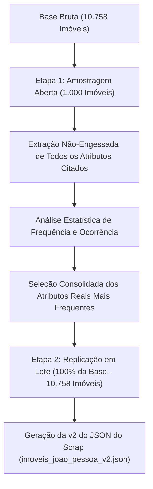

# Metodologia Empírica da Issue #9: Amostragem Aberta e Descoberta Científica de Atributos via LLM

**Autor:** Gabriel Ribeiro (`@gabrielbribeiroo`)  
**Projeto:** Previsão e Análise de Preços de Imóveis em João Pessoa (PB)  
**Disciplina:** Paradigmas de Aprendizagem de Máquina — UFPB  
**Módulo:** `src/imoveis_jp/processing/extract_llm_features.py`  
**Data:** 30/07/2026  

---

## 1. Fundamentação Científica da Metodologia Empírica em 2 Etapas

Para evitar decisões arbitrárias sobre quais atributos devem ser extraídos dos textos livres das descrições, adotou-se uma **metodologia estritamente orientada a dados (Data-Driven Discovery)** dividida em 2 etapas:



---

## 2. Etapa 1: Amostragem Aberta (Descoberta de Atributos)

### 🔬 O Que É Executado
1. Seleciona-se uma amostra representativa de **1.000 imóveis** da base bruta.
2. A LLM recebe o texto da descrição sem um schema de chaves engessadas predefinidas, instruída a listar **todas as características, condições comerciais, orientações e diferenciais citados**.
3. O script contabiliza a frequência de ocorrência de cada frase/atributo na amostra.

### 📊 Critério de Seleção dos Atributos Finais
Serão promovidos a colunas fixas da versão final apenas os atributos que apresentarem **frequência e relevância estatística comprovada** na amostragem dos 1.000 imóveis.

---

## 3. Etapa 2: Consolidação e Replicação para Toda a Base

Com o schema definitivo validado empiricamente:
1. Aplica-se a extração em lote (`--batch-size 5`) para os 10.758 imóveis da base.
2. Executa-se o `--merge` gerando o dataset tabular `data/interim/llm_features_normalized.csv` e a **Versão 2 do JSON do Scrap** (`data/interim/imoveis_joao_pessoa_v2.json`).

---

## 4. Guia de Execução

```powershell
# 1. Executar a Amostragem Aberta (Etapa 1 - 1.000 imóveis):
.\.venv\Scripts\python.exe -m imoveis_jp.processing.extract_llm_features --discover --limit 1000

# 2. Executar a Replicação Final em Lote para toda a base (Etapa 2):
.\.venv\Scripts\python.exe -m imoveis_jp.processing.extract_llm_features --batch-size 5

# 3. Exportar CSV e v2 do JSON do Scrap:
.\.venv\Scripts\python.exe -m imoveis_jp.processing.extract_llm_features --merge
```
