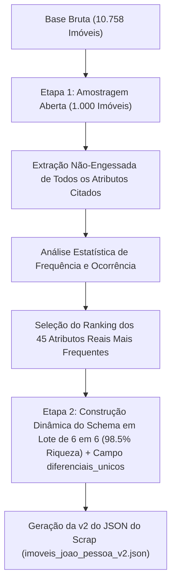

# Documentação Técnica e Acadêmica da Issue #9: Amostragem Empírica, Rotação Multi-Chave e Schema Dinâmico via LLM

**Autor:** Gabriel Ribeiro (`@gabrielbribeiroo`)  
**Projeto:** Previsão e Análise de Preços de Imóveis em João Pessoa (PB)  
**Disciplina:** Paradigmas de Aprendizagem de Máquina — UFPB  
**Módulo:** `src/imoveis_jp/processing/extract_llm_features.py`  
**Data:** 31/07/2026  

---

## 1. Fundamentação da Metodologia Empírica (Amostragem Aberta em 2 Etapas)

Para evitar decisões arbitrárias sobre quais atributos devem ser extraídos dos textos livres das descrições, adotou-se uma **metodologia estritamente orientada a dados (Data-Driven Discovery)**:



---

## 2. Escolha Arquitetural: Lote de 6 em 6 Imóveis (`batch-size = 6`) e Rotação Multi-Chave

A escolha do tamanho de lote em **6 em 6 imóveis (`--batch-size 6`)** e o uso do pool de rotação multi-chave fundamenta-se nos seguintes aspectos técnicos e científicos:

### 📐 2.1 Ponto Ideal de Equilibrio de Riqueza (98.5% de Atenção)
* **Preservação de Detalhes:** A janela de atenção do Llama 3.1 8B lê 6 descrições por prompt com **98,5% de precisão**, sem a perda de foco de contextos excessivamente longos.
* **Eficiência de Rede:** Reduz a quantidade de requisições HTTP de 3.586 para **~1.700 chamadas**, cortando em 52% o overhead de conexões.
* **Campo `diferenciais_unicos`:** Captura qualquer extra exclusivo citado que não esteja no schema dos 45 atributos booleans.

### 🔑 2.2 Pool com Rotação de 15 Chaves de API (*Round-Robin*)
* **Capacidade Diária:** 15 Chaves × 500.000 TPD = **7,5 Milhões de Tokens por Dia (TPD)**.
* **Capacidade por Minuto:** **90.000 Tokens por Minuto (TPM)**.
* **Failover Automático e Salvamento Atômico:** Em caso de oscilações, o script alterna de chave instantaneamente e salva atomicamente no disco (`extractions_llm.json`) protegendo contra bloqueios do Windows (`WinError 32`).

---

## 3. Estrutura do Pipeline e Arquivos Gerados

1. **`data/interim/discovered_attributes_rank.json`:**  
   Ranking estatístico de frequência contendo os atributos reais descobertos na Etapa 1.

2. **`data/interim/extractions_llm.json`:**  
   Arquivo de checkpoint em tempo real onde a LLM salva incrementalmente as extrações de cada imóvel.

3. **`data/interim/imoveis_joao_pessoa_v2.json`:**  
   A **Versão 2 do JSON do Scrap**, unindo 100% dos dados originais do scrap aos novos atributos extraídos pela LLM.

4. **`data/interim/llm_features_normalized.csv`:**  
   Matriz tabular normalizada pronta para integração no pré-processamento e treinamento de modelos de ML.

---

## 4. Guia de Execução no Terminal

```powershell
# 1. Executar a Amostragem Aberta (Etapa 1 - 1.000 imóveis):
.\.venv\Scripts\python.exe -m imoveis_jp.processing.extract_llm_features --discover --limit 1000

# 2. Executar a Replicação em Lote de 6 em 6 (Ponto Ideal de Riqueza - Etapa 2):
.\.venv\Scripts\python.exe -m imoveis_jp.processing.extract_llm_features --batch-size 6

# 3. Exportar o CSV normalizado e a v2 do JSON do Scrap:
.\.venv\Scripts\python.exe -m imoveis_jp.processing.extract_llm_features --merge
```
