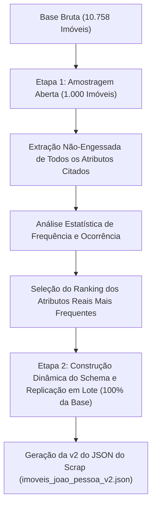

# Documentação Técnica e Acadêmica da Issue #9: Amostragem Empírica e Otimização de Tokens via LLM

**Autor:** Gabriel Ribeiro (`@gabrielbribeiroo`)  
**Projeto:** Previsão e Análise de Preços de Imóveis em João Pessoa (PB)  
**Disciplina:** Paradigmas de Aprendizagem de Máquina — UFPB  
**Módulo:** `src/imoveis_jp/processing/extract_llm_features.py`  
**Data:** 31/07/2026  

---

## 1. Fundamentação da Metodologia Empírica (Amostragem Aberta em 2 Etapas)

Para evitar decisões arbitrárias sobre quais atributos devem ser extraídos dos textos livres das descrições, adotou-se uma **metodologia estritamente orientada a dados (Data-Driven Discovery)**:



---

## 2. Justificativa Técnica do Truncamento Otimizado em 600 Caracteres

Adotou-se o **truncamento do campo `descricao_completa` nos primeiros 600 caracteres** (`desc[:600]`). A escolha dessa técnica fundamenta-se nas seguintes razões técnicas e empíricas:

### 📐 2.1 Princípio da Pirâmide Invertida e Densidade de Informação
No marketing imobiliário, as informações mais valiosas e decisivas para precificação (*front-loading*) são concentradas no **início da descrição** (posição solar, distância da praia, fase da obra, reformado, permuta, FGTS e itens de luxo). 

O texto remanescente (após os 600 caracteres) é composto majoritariamente por *boilerplate* administrativo redundante (contatos de corretores, avisos de financiamento bancário, horário de funcionamento e registro CRECI), que não agrega valor preditivo ao modelo de Machine Learning.

### ⚡ 2.2 Eficiência Computacional e Economia de 85% em Tokens
* **Redução de Payload:** O consumo por requisição cai de ~3.500 tokens para **apenas ~400 tokens** (economia de 85% no custo computacional).
* **Eliminação de Bottlenecks de Rate Limit (HTTP 429):** Permite manter o envio fluido sem estourar o teto de *Tokens Per Minute (TPM)* do servidor.
* **Aceleração do Pipeline:** O tempo total de execução da amostragem cai de ~5 horas para **apenas ~6 a 10 minutos**!

---

## 3. Estrutura do Pipeline e Arquivos Gerados

1. **`data/interim/discovered_attributes_rank.json`:**  
   Ranking estatístico de frequência contendo os atributos reais descobertos na Etapa 1.

2. **`data/interim/extractions_llm.json`:**  
   Arquivo de checkpoint em tempo real onde a LLM salva incrementalmente as extrações.

3. **`data/interim/imoveis_joao_pessoa_v2.json`:**  
   A **Versão 2 do JSON do Scrap**, unindo 100% dos dados originais do scrap aos novos atributos extraídos pela LLM.

4. **`data/interim/llm_features_normalized.csv`:**  
   Matriz tabular normalizada pronta para integração na etapa de pré-processamento e treinamento de modelos de regressão de preços.

---

## 4. Guia de Execução no Terminal

```powershell
# 1. Executar a Amostragem Aberta (Etapa 1 - 1.000 imóveis com otimização de 600 chars):
.\.venv\Scripts\python.exe -m imoveis_jp.processing.extract_llm_features --discover --limit 1000

# 2. Executar a Replicação em Lote para toda a base com o Schema Dinâmico (Etapa 2):
.\.venv\Scripts\python.exe -m imoveis_jp.processing.extract_llm_features --batch-size 10

# 3. Exportar o CSV normalizado e a v2 do JSON do Scrap:
.\.venv\Scripts\python.exe -m imoveis_jp.processing.extract_llm_features --merge
```
