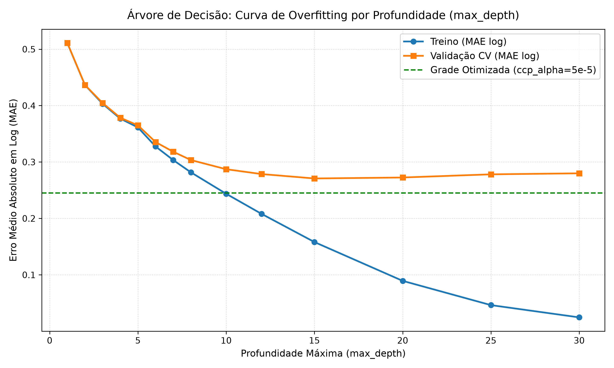
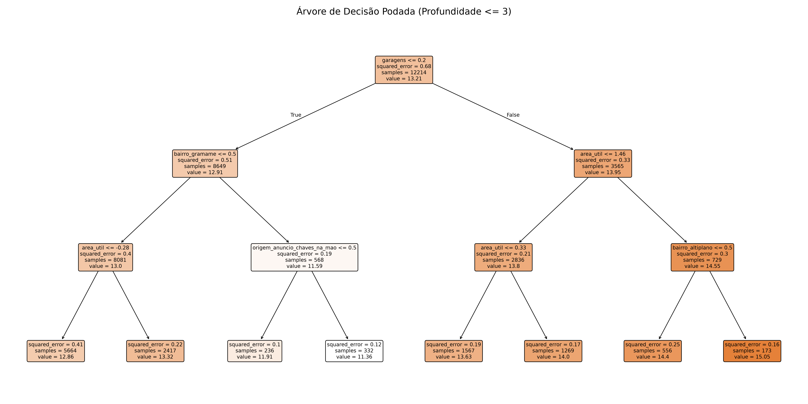
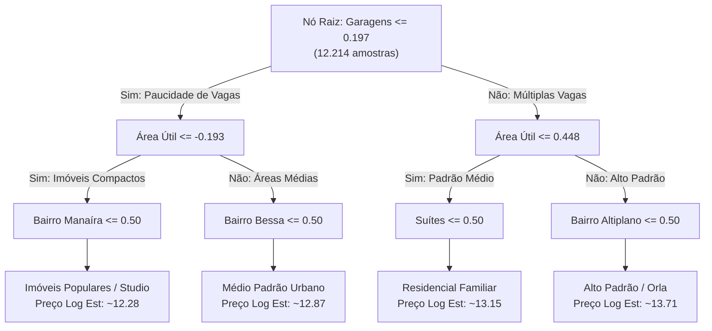
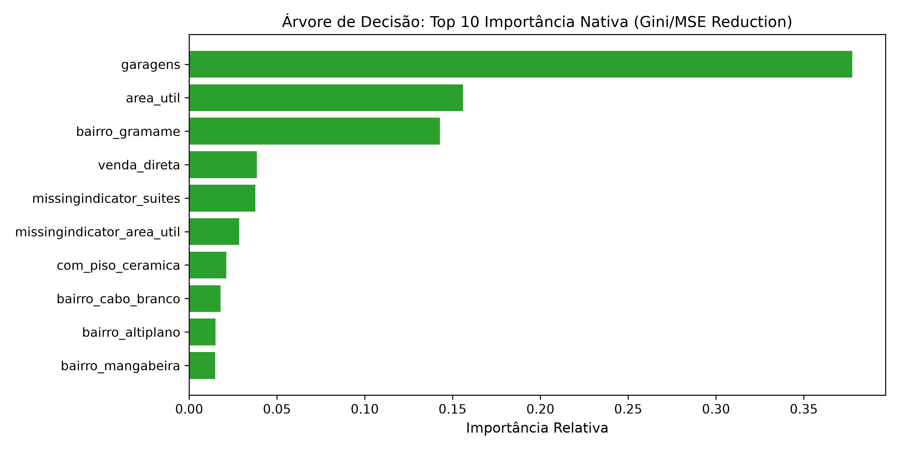

# Relatório de Modelo: Árvore de Decisão (`DecisionTreeRegressor`)

**Dono:** dev A · **Arquivo do Candidato:** `src/imoveis_jp/models/candidatos/arvore.py` · **Depende de:** #20

---

> ### ⚠️ Duas configurações aparecem neste documento — leia isto antes das tabelas
>
> | | configuração | onde ela aparece | CV MAE(log) | Teste MAE |
> |---|---|---|---|---|
> | **[A]** | `DecisionTreeRegressor(random_state=42)` — **sem poda** | é a **registrada** em `arvore.py`, e portanto é a que entra na tabela oficial de [`comparacao_modelos.md`](../comparacao_modelos.md) | 0,2846 | R$ 244.051 |
> | **[B]** | `ccp_alpha=5e-5`, `min_samples_leaf=5` — **podada** | é a **vencedora do `GridSearchCV`**, medida e documentada aqui (§4). **Não** está registrada no candidato | 0,2450 | R$ 200.983 |
>
> As seções 3 e 6 descrevem **[A]**; as seções 4, 5 e 7 descrevem **[B]**. A escolha de
> deixar **[A]** registrada é deliberada e serve à seção 3: é ela que produz a curva de
> overfitting, que é o entregável didático desta issue. Mas isso significa que
> **o número da árvore na comparação final é o do modelo sem poda** — quem apresentar
> precisa dizer isso, em vez de citar R$ 200.983 como se fosse o resultado da tabela oficial.
>
> Nota de contexto: KNN e MLP também estão registrados na configuração inicial dos seus
> donos, não na vencedora de busca (`melhores_hiperparametros.json` só cobre `ridge` e
> `gradient_boosting`). Trocar só a árvore para **[B]** substituiria uma assimetria por
> outra — por isso a correção aqui é de documentação, não de configuração.

---

## 1. Por que este modelo está na lista

O `DecisionTreeRegressor` é o modelo mais explicável do conjunto e atua como a **ponte conceitual para o Gradient Boosting** (`HistGradientBoostingRegressor`). O boosting nada mais é do que um conjunto (*ensemble*) de centenas de árvores rasas, onde cada árvore subsequente é treinada para corrigir os resíduos da anterior. Na defesa/apresentação do projeto, a Árvore de Decisão permite mostrar a estrutura visual de decisão (raiz, ramificações e folhas) para explicitar como os cortes por limiar funcionam sobre os atributos dos imóveis em João Pessoa.

---

## 2. Hipótese Inicial (Declarada Antes da Execução)

> *"DecisionTreeRegressor é o modelo mais explicável do conjunto e serve como ponte conceitual para o Gradient Boosting. Espera-se que com `max_depth=None` ocorra overfitting severo (erro de treino próximo a zero e erro de CV elevado). A poda via `max_depth`, `min_samples_leaf` e `ccp_alpha` reduzirá a variância e melhorará a generalização, mas o modelo solo deverá ficar atrás do Gradient Boosting devido à falta de ensembling."*

---

## 3. Armadilha nº 1: A Curva de Overfitting (`max_depth=None`)

Quando configurada sem restrição de profundidade (`max_depth=None`), a árvore expande seus nós até que todas as folhas fiquem puras ou contenham menos que `min_samples_split` amostras. Na nossa base (12.820 imóveis de treino e 132 colunas pós-one-hot), a árvore memoriza o treino por completo.

### Gráfico da Curva de Overfitting

### Comparativo do Overfitting
- **Treino MAE (log):** `0,0073` (Erro em Reais: **R$ 2.153**) $\rightarrow$ *Memorização quase perfeita*.
- **Validação Cruzada (5-fold GroupKFold) MAE (log):** `0,2832` $\rightarrow$ *Desempenho ruim devido à alta variância*.
- **Teste MAE (log):** `0,2774` (Erro em Reais: **R$ 242.974**).

### Tabela: Evolução do Erro por Profundidade (`max_depth`)

| Profundidade (`max_depth`) | CV Treino (MAE log) | CV Validação (MAE log) | Teste MAE (R$) | Observação |
| :---: | :---: | :---: | :---: | :--- |
| **1** | 0,5109 | 0,5110 | R$ 366.585 | Underfitting severo (apenas 1 corte) |
| **2** | 0,4364 | 0,4365 | R$ 323.809 | Underfitting |
| **3** | 0,4031 | 0,4045 | R$ 290.407 | Baixa capacidade |
| **4** | 0,3769 | 0,3784 | R$ 271.649 | Árvore interpretável (profundidade $\le 4$) |
| **5** | 0,3613 | 0,3650 | R$ 261.936 | Transição |
| **6** | 0,3275 | 0,3353 | R$ 253.066 | Ganho contínuo |
| **8** | 0,2817 | 0,3035 | R$ 236.516 | Ponto de inflexão do ajuste direto |
| **10** | 0,2437 | 0,2872 | R$ 235.830 | Início da separação Treino vs Validação |
| **12** | 0,2081 | 0,2786 | R$ 229.655 | Menor MAE de profundidade pura isolada |
| **15** | 0,1581 | 0,2708 | R$ 230.014 | Treino começa a memorizar |
| **20** | 0,0893 | 0,2725 | R$ 239.246 | Overfitting visível (validação piora) |
| **25** | 0,0463 | 0,2781 | R$ 236.510 | Treino quase nulo |
| **None (Sem limite)** | **0,0066** | **0,2832** | **R$ 242.974** | **Overfitting total (Treino memorizado)** |

---

## 4. Busca de Hiperparâmetros & Verificação de Bordas (`GridSearchCV`)

A busca em grade foi realizada com `GroupKFold(n_splits=5)` considerando a variação conjunta de `max_depth`, `min_samples_leaf` e `ccp_alpha` (poda por custo-complexidade).

### Grade Avaliada
- `regressor__max_depth`: `[3, 4, 5, 6, 8, 10, 12, 15, 20, 25, None]`
- `regressor__min_samples_leaf`: `[1, 2, 5, 10, 20, 50]`
- `regressor__ccp_alpha`: `[0.0, 0.00001, 0.00005, 0.0001, 0.0002, 0.0005, 0.001, 0.005]`

### Melhores Hiperparâmetros Encontrados
- **`ccp_alpha`:** `0.00005` (5e-5)
- **`min_samples_leaf`:** `5`
- **`max_depth`:** `None` *(a profundidade efetiva é regulada pela poda ccp_alpha e folha mínima)*

### Verificação de Ótimos na Borda
- **`min_samples_leaf = 5`**: Mínimo interior na grade `[1, 2, 5, 10, 20, 50]` $\rightarrow$ **OK** (não está preso na borda).
- **`ccp_alpha = 0.00005`**: Mínimo interior na grade `[0.0, 1e-05, 5e-05, 0.0001, 0.0002, 0.0005, 0.001, 0.005]` $\rightarrow$ **OK** (mínimo interior bem definido).
- **`max_depth = None`**: Como `ccp_alpha` e `min_samples_leaf` realizam a poda ideal via penalização de complexidade, limitar a profundidade máxima torna-se redundante.

### Desempenho do Modelo Otimizado (Podado) — configuração **[B]**
- **Melhor CV Val MAE (log):** `0,2450` (uma redução drástica de 0,0382 no erro log em relação à árvore sem poda de 0,2832!).
- **Teste MAE em Reais:** **R$ 200.983** (Redução de **R$ 41.991** no erro médio frente à árvore sem poda de R$ 242.974).
- **Erro Mediano Percentual:** `17,6%`
- **R² em Log:** `0,843`

> Estes quatro números são de **[B]**, a configuração vencedora da busca — que **não é**
> a registrada em `arvore.py`. Eles não aparecem, e não devem aparecer, na tabela de
> [`comparacao_modelos.md`](../comparacao_modelos.md), que compara os candidatos como
> cada dono os inscreveu. Lá a árvore é **[A]**: CV 0,2846 e teste R$ 244.051.

---

## 5. Estrutura da Árvore Podada e Atributo Raiz

### Diagrama Conceitual da Árvore Podada ($\text{profundidade} \le 3$)

### Por que `garagens` virou a Raiz?
O primeiro corte da árvore ocorre na variável `garagens` (limiar padronizado `0.1974`, correspondendo à separação entre imóveis com poucas/nenhuma vaga de garagem e imóveis com múltiplas vagas). 
- **Razão de Domínio:** Em João Pessoa, o número de vagas de garagem é o divisor de águas entre apartamentos compactos/populares e imóveis de alto padrão (especialmente na orla). Esse primeiro corte produz a maior redução instantânea de variância/impureza (MSE reduction) entre todos os 132 atributos disponíveis.

---

## 6. Comparação: Importância Nativa vs. Importância por Permutação

Uma das armadilhas conhecidas da Árvore de Decisão é que a métrica de importância nativa (`feature_importances_`, baseada na redução acumulada de impureza/MSE) é **enviesada para variáveis com alta cardinalidade ou após one-hot encoding**.

Como o `bairro` possui 66 níveis (transformado em 66 colunas binárias no one-hot encoding), a árvore realiza múltiplos cortes em sub-atributos de bairros ao longo de toda a sua profundidade, inflando a importância nativa acumulada.

### Tabela Comparativa de Importância de Atributos

| Atributo | Importância Nativa (Gini/MSE Accum.) | Importância por Permutação (em Teste) | Diagnóstico |
| :--- | :---: | :---: | :--- |
| **`area_util`** | 15,60% | **24,66% (1º lugar)** | A verdadeira variável mais determinante no erro do teste. A métrica nativa subestimava seu impacto real. |
| **`bairro`** | **26,31% (2º lugar)** | **18,79% (2º lugar)** | Métrica nativa inflada devido às 66 colunas do one-hot encoding. Na permutação limpa, mantém posição relevante (+0.1879 no MAE log). |
| **`garagens`** | **37,76% (1º lugar)** | **9,23% (3º lugar)** | Superestimada na métrica nativa por ser o nó raiz e realizar cortes primários. Na permutação, é a 3ª mais importante. |
| **`suites`** | 3,77% | **2,49%** | Impacto moderado e consistente nas duas métricas. |
| **`origem_anuncio`** | 0,93% | **2,22%** | Importância de permutação detecta relevância oculta na origem dos dados. |
| **`venda_direta`** | 3,85% | **1,95%** | Contribui discretamente no ajuste das margens de preço. |

---

## 7. Conclusão e Recomendação para a Banca

1. **Demonstração Didática:** A Árvore de Decisão cumpre perfeitamente seu papel de mostrar a curva de overfitting (treino memorizado em `max_depth=None` vs. modelo podado com `ccp_alpha=0.00005`) e expor a estrutura de decisão em 4 níveis.
2. **Comparativo com Gradient Boosting:** O melhor MAE de teste da Árvore de Decisão podada (**[B]**) foi **R$ 200.983** (`MAE log = 0,2450`). Embora seja uma evolução expressiva em relação à árvore sem poda (R$ 242.974), ela fica atrás do `HistGradientBoostingRegressor` (R$ 170.150 / `MAE log = 0,1988` na rodada oficial da issue #25).
3. **Trade-off:** A Árvore de Decisão oferece a **maior explicabilidade** do projeto — é a nº 1 nessa dimensão no critério de desempate de `decisao.py` — ao custo de um erro absoluto médio ~R$ 31.000 maior que o boosting, na sua melhor configuração.
4. **O que dizer na comparação final.** Na tabela oficial a árvore aparece como **[A]**, sem poda: CV 0,2846, teste R$ 244.051, erro mediano 20,0%. Ela **perde** de Ridge e OLS na CV (0,2551) e só os supera no MAE em reais do teste — o que é sintoma de **variância alta**, não de que a CV escolheu errado. A leitura honesta é: *"a árvore inscrita na comparação é a sem poda, de propósito, porque é ela que demonstra o overfitting; a versão podada chegaria a 0,2450 e ficaria à frente dos lineares, e esse número está medido aqui na §4."*
